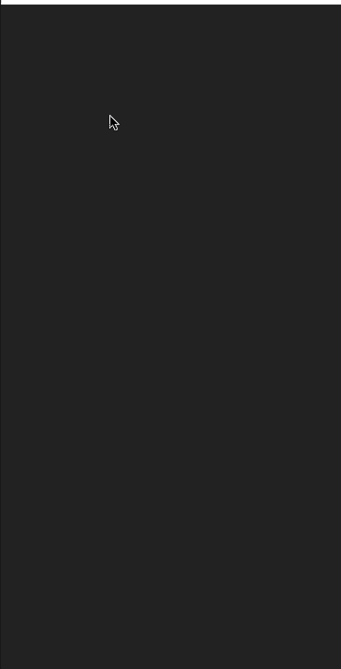

# Module Challenge: iOS Development Tools - Sprites

This challenge allows you to practice the concepts and techniques learned in today's guided lesson and apply them in a concrete project. Your lesson explored core iOS Development Tools. You will demonstrate proficiency by building a simple Sprite Kit application.

## Instructions

**Read these instructions carefully. Understand exactly what is expected _before_ starting this Challenge.**

This is an individual assessment but you are permitted to consult with and support other members of your cohort. You are encouraged to follow the twenty-minute rule and seek support from your PM and Instructor in your cohort help channel on Slack. 

## Commits

Commit your code regularly and meaningfully. This helps both you (in case you ever need to return to old code for any number of reasons) and your project manager.

## Questions

Demonstrate your understanding of today's concepts by answering the following free-form questions. Submit them as a text file along with your project.

* Why do we use version control? Under what circumstances would you need version control features and why?
* What are the navigator, editor, and inspectors areas in Xcode? What are their roles and how do you use them?
* How do you center a view in Interface Builder? How do you stretch one?
* What is SpriteKit and why do people use it?


## Preparatory work

Follow these steps and create your project:

- Fork this repository to your personal account.
- Clone your forked repository to your personal development folder.
- Create a new Xcode project named Sprites and save it *inside* the repository's folder. It's really important that you save it to the right place, otherwise you will not be able to properly submit your project when complete.

## Setting Up

Follow these steps and set up your project:

- Select your project name (first blue item at the top left) in the Project Navigator (View > Navigators > Show Project Navigators) and set the Target to use Portrait-only deployment as you did in class.
- Select Main.storyboard in your Project Navigator.
- In Interface Builder, add a SpriteKit View to your main interface by dragging from the object library.
- With the SKView selected, use the Tie-Fighter ("Add New Constraints") button at the bottom right of IB's editor window to constrain each edge flush to the parent. Set each inset to 0 and add 4 constraints.
- Open the assistant editor by option-clicking ViewController.swift.
- Control-drag from your SKView to the ViewController class and add a new outlet called skview.
- Return to the standard single editor. (View > Standard Editor > Show Standard Editor)
- Create a CustomScene.swift file. Set its contents:

```
import UIKit
import SpriteKit

class CustomScene: SKScene {
    public override func touchesBegan(_ touches: Set<UITouch>, with event: UIEvent?) {
        guard !touches.isEmpty, let touch = touches.first
            else { return }
        
        // Work with your touch here
    }
}
```

- Edit your view controller class code to match the following:

```
import UIKit
import SpriteKit

class ViewController: UIViewController {
    @IBOutlet var skview: SKView!
    
    var skscene: CustomScene? = nil
    
    override func viewDidAppear(_ animated: Bool) {
        super.viewDidAppear(animated)
        skscene = CustomScene(size: view.bounds.size)
        skview.presentScene(skScene)
    }
}
```

## Add Nodes

Shape nodes are simple to create and use. You'll create a simple circle node and add one for each touch. Add this code to your CustomScene's `touchesBegan` method:

```
        let node = SKShapeNode(circleOfRadius: 8)
        node.fillColor = .red
        node.position = touch.location(in: self)
        addChild(node)
```

Test and run the app, making sure it works as expected (a red dot appears at each touch). Then at the command line, add, commit, and push your changes to your fork. If this does not work as expected, make sure you're working with a forked repository and _not_ with the original LambdaSchool repo. Make sure you use a meaningful commit message.

Here's what your project should look like when run:




## Stretch Problems

After finishing your required elements, push your work further. These goals may or may not be things you learned in this module but they build on the material you just studied. Time allowing, stretch your limits and see if you can deliver on the following optional goals.

These steps are optional but encouraged, showing that you have mastered the basics and can move on further. Use additional commits for each stretch goal and note them in your pull request:

* Use the random color code from this morning to make each shape node a different color. Use a range of `0.5 ... 1.0` for brighter colors.
* After adding each node, run a sequence action that zooms the node to 130% of its original size and returns the node back from that by adapting code from this morning. This sequence only has two steps, not three.
* Place each node in the center of the scene at first (at position `CGPoint(x: frame.midX, y: frame.midY)`) before moving it to the touch's location in the view.

Here's a preview of the first and second stretch goals:


And adding the third stretch goal:


